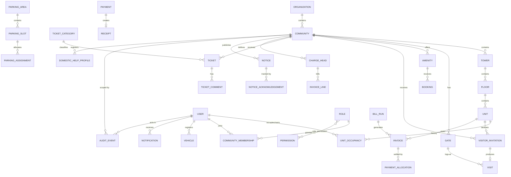

# DATABASE.md — SocietyOS Data Model

PostgreSQL + Prisma. UUID primary keys (never sequential public IDs for
authorization). Human-friendly reference numbers are separate columns
(`VIS-2026-000123`, `TKT-2026-000381`, `INV-2026-000211`, `RCT-2026-000109`).

## Conventions

- Every tenant-owned table has `communityId` with index.
- `createdAt` / `updatedAt` on all tables; soft-delete (`deletedAt`) where
  history must survive (residents, units, invoices).
- Money = `Int` paise. Timestamps = UTC `timestamptz`.
- Historical occupancy uses effective-from/effective-to dates — never overwrite.

## ER diagram (Release 1 scope)

Release 2 adds: Account, AccountGroup, Journal, JournalEntry, JournalLine,
FiscalYear, Voucher family, BankAccount, Reconciliation, Vendor, Staff,
Attendance, PurchaseRequest/Order, Expense, Asset, InventoryItem,
StockMovement, Document, Poll, MoveRequest, CommitteeMember, Task.

## Key tables (narrative)

- **User** — global identity (phone/email unique). Auth credentials separate
  from profile. No tenant data on User itself.
- **CommunityMembership** — user↔community with role(s); source of tenant
  authorization context.
- **UnitOccupancy** — `(unitId, userId, kind=OWNER|TENANT|FAMILY,
  effectiveFrom, effectiveTo)`; multiple owners, past tenants preserved.
- **VisitorInvitation** — pre-approvals & spot requests share one lifecycle;
  opaque short-lived tokens for QR/OTP (never PII in QR payload).
- **Visit** — the gate log row (check-in/out, approvals, overrides, guard).
- **Invoice / InvoiceLine / Payment / PaymentAllocation / Receipt** — billing
  core; issued documents immutable (adjust via credit note/cancel workflows).
